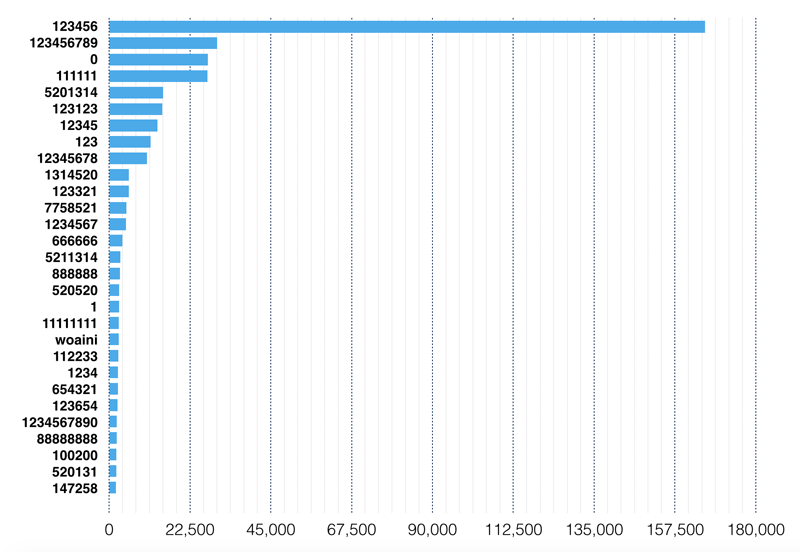
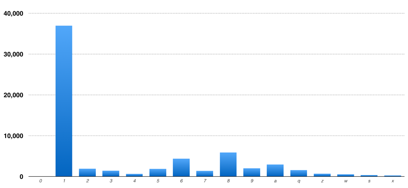
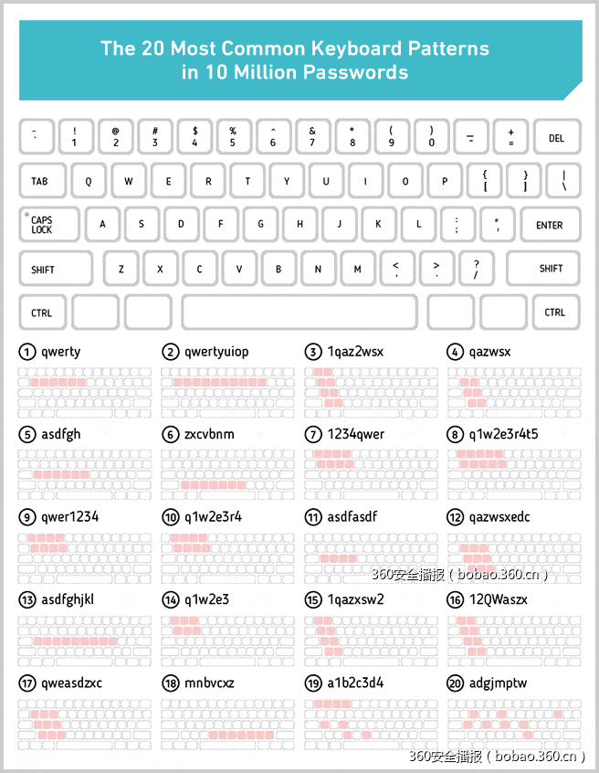
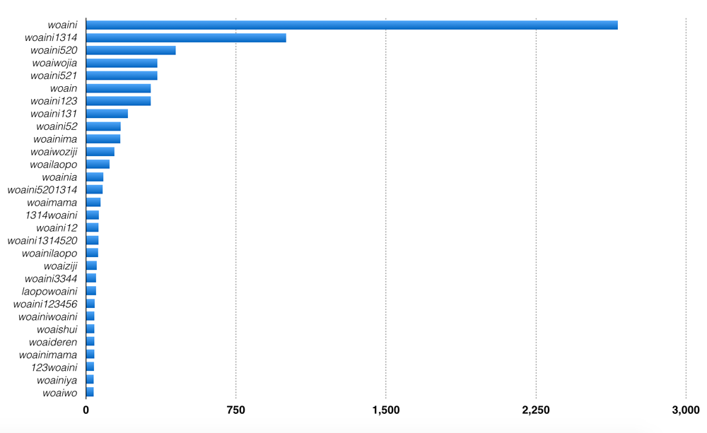
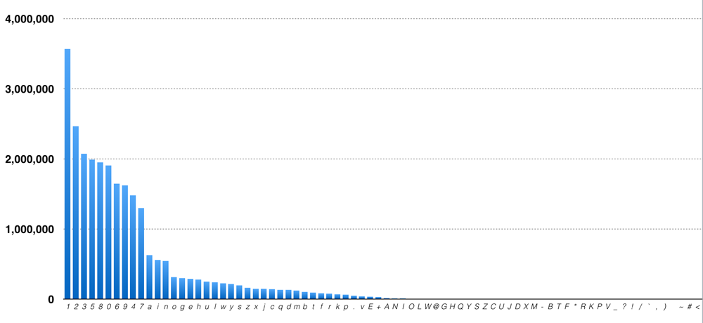
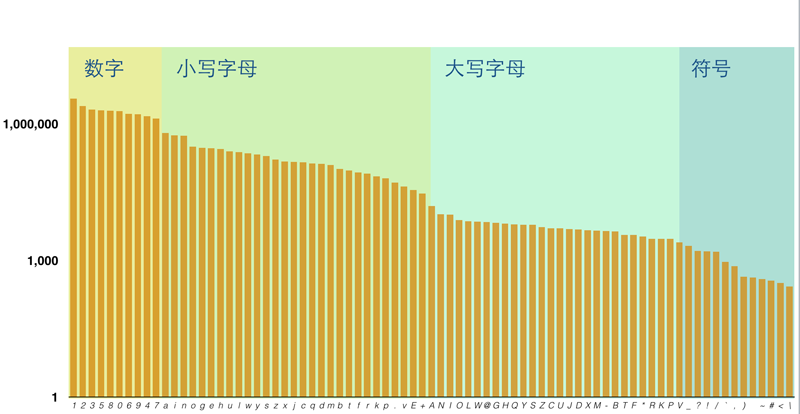

# 密码漫游记

## 总览

今天下午，乌云漏洞报告平台宣布网易邮箱漏洞过亿数据泄漏，我去，据说有亿级别的用户密码流出..

现在网易官方还在和乌云互掐，真相估计还要时间，但小编反问，你的密码设计合理吗？

<!--很少有人会和你交流他是怎么设计密码的，但有了大量数据，我们能通过简单的统计，发现不同人思路的共性。-->

2011年起有一系列重大网站密码泄露，csdn社区、人人网、多玩网、微博的部分密码数据都被挂到了网上(数据请自行google，本文讨论思路，展示结果，不泄露信息)。

我们以当时微博的3315156条用户名密码数据，开始分析之旅。

## 工具

而我们下载到的文件类似于csv(逗号分隔) 或tsv格式（空格分隔）数据，如：

```
mail  password  
xxxx@yahoo.com.cn	198869	
yyyy@sina.com	5201985926	
```
数据很大，需要的查询可能很复杂，纯脚本处理很难胜任，我们需要数据库, 本文就用mongoDB了。

我们可以在命令行里使用mongoimport命令导入数据，也可以使用脚本（我用node.js）导入，脚本更灵活。导完后，可以直接在命令行（如mac的terminal）查询:

```
//密码为1234的同学共2438个
> db.passwords.count({password:'1234'})
2438
```
以上，括号里面的叫查询条件，这在本文中很重要，我们可以在查询条件里插入正则表达式（网上资料大大的），让查询变得更复杂:

```
//密码用888结尾的同学共15813个
> db.passwords.count({password:{$regex:/888$/}})
15813
```
最后，有时候我们要统计，比如密码以a、b、c、d..，各有多少，这时我们需要用mapreduce，mapreduce可以处理很多数据，但是在mongo执行mapreduce较复杂，一般在脚本里写好了去执行。

嘿嘿，工具只是手段，白猫黑猫，能抓老鼠的就是好猫。

启程！


## 密码top100，都有些啥
运行mapreduce，很容易跑出前100的密码， 以下是前二十名:


很容易发现规律，俺将此类密码的主人分五大派系：

- 极懒派
- 手势派
- 规律派
- 手机派
- 生日派
- 情感派

## 极懒派：
这3万多同学真是懒的令人发指,也刷新了哥的常识，喝喝...

| 密码| 排名 | 重复 |
| ----|:-----:| -----:|
|0|3|27458次|
|111111|4|27328次|
|1|18|2781次|
|@163.com|51|1015次|
|password|70|755次|
|@qq.com|74|714次|

1. 那时候微博竟然能通过一个字的密码。
2. password也是老外的高频词，我不知道是不是某些网站输入框里password提示词的误导。
3. 单字重复型，如 11111，让我们深入发掘下。
4. 最有意思的是163.com和@qq.com出现的频率，而这1000多用户，密码=用户名后半部分...

##### 极懒派.一字重复n次
推广一下，统计形如 'aa', '11111', 'ssssssss'这类若干个相同单字的密码总数。
正则表达式可以让我们很方便地去进行查询: 

```
//查询所有完全由1构成重复2次以上的密码
var query = {
   password:{
     $regex: '/^1{2,}$/'
   }
}
```
我统计了 1、2、3、4、5、6、7、8、9、0、q、a、z、w、s、d的频率分布，其中用'111111'型的用户最多
这些密码总计6w多人 占2%。



##### 极懒派.用户名=密码
上述统计不包含用户名和密码相同的密码，这部分密码共有多少呢?

以abcd@qq.com 为例，我们统计这3种模式的数量之和：

- abcd@qq.com 
- abcd
- @qq.com 。

99671个人，有点意外，整整占了3%呢!


## 手势派：
密码太长，能在键盘上排成一种形状，记忆成本就大大压缩，在密码排行榜上，和图形有关的密码是哪些？
123456云云者，勉强算吧，在数字键盘划一字。同理qwerty开头的也是这个原理。

| 密码| 排名 | 重复 |
| ----|:-----:| -----:|
|qazwsx|50|1017次|
|qwerty|67|777次|
|123qwe|78|680次|
|asdfgh|87|549次|

对此，我看到一位老外很牛逼地总结了20种模式:



这个模式很牛逼，图上是键盘密码。但11年已经有很多人用手机上微博了。有不少这种手机键盘，因此很多密码为啥长也就迎刃而解了。

| 1| 2 | 3 |
| ----|:-----:| -----:|
|4|5|6|
|7|8|9|

| 密码| 排名 | 重复 |
| ----|:-----:| -----:|
|147258|29|1899次|
|147258369|40|1538次|
|159357|41|1402次|
|159753|54|993次|


## 规律派：
记住一串数字的规律，我们就可以把一串简单的数字演绎成复杂密码，而你记住规则就好。

很勉强，123456就是个等差数列
```fn = n```
而 13579是 
```fn = 2*n-1```

很多人会用叠词 如123123，112233，或叠加后对称 123321
高分密码有这些:

| 密码| 排名 | 重复 |
| ----|:-----:| -----:|
|123123|6|14838次|
|112233|21|2536次|
|102030|100|484次|


可以引申下，同样是数列，用了中学知识就不一样啦，假设我们让 ```fn = n^2```, 我们就可以构造一个数列了：

 1 2 3 4 5 6 -> 1 4 9 16 25 36..

我查询了含有1491625的所有密码，共找到30几个，真是海内存知己（因为曾经我也是这么设计的）

同理 1 8 27 64 125 的只有3个人，高手啊

如果你拿12345开根号、取三角函数、取对数，忘记密码，在手机计算机里算一遍（别忘了公式）。

海内无知己，天涯只有你，你赢了！


## 手机派：
使用自己和亲人的生日、电话、手机做密码，已是我对普通密码的印象了，这部分人究竟多不多？

用手机做密码，一开始我设置了11位的数字的条件，但是有很多错误的结果。好在网上有对手机号码检测的正则表达式，包含了2013年前所有的手机字段:

- 移动：139 138 137 136 135 134 147 150 151 152 157 158 159 178 182 183 184 187 188  
- 联通： 130 131 132 155 156 185 186 145 176  
- 电信： 133 153 177 180 181 189  
- 虚拟运营商：170

因此[大神](http://blog.csdn.net/fengshi_sh/article/details/12085307)整理了一个可以查询手机号的正则表达式：

```javascript
//对前三位进行排查，排除所有一定不是手机号的密码
var query = {
   password:{
     $regex: '/^0?(13[0-9]|15[012356789]|17[0678]|18[0-9]|14[57])[0-9]{8}$/'
   }
}
```

亲测有效哦，出来的密码几乎都是手机号， 172418个同学用手机号做密码 占比5%。

## 生日/纪念日派：

我们查询所有包含年份的密码，这些年份都以19和20开头，且有4位连续数字， 考虑到5201314(我爱你一生一世)也是高频密码，且密码数据的时间为2011年，此时2013不该出现，所以排除2011年以后的年份，我们得到如下结果:

```javascript
//对年份进行筛选
var query = {
   password:{
     $regex: '/(19(\d{2})|200[0-9]|2010|2011)/'
   }
}
```

543559个密码使用了年份，占总量的18%。
真不是小数字，但数据还是很复杂，有大量年份和字母，符号混合的，也不一定就是年份。那我们缩小范围，如果包含生日的有多少人？

月份比较复杂，1月1日出生的，也许写11，也许写0101，也有1.1、1-1的。但后者其实比较少，且在在这篇分析[人人和csdn密码的文章](https://program-think.blogspot.com/2011/12/csdn-renren-password-analysis.html)里看到YYMMDD型的生日是最多的:

| 日期格式| CSDN (%) | RenRen (%) |
| ----|:-----:| -----:|
| YYMMDD| 0.14 | 3.59 |
| YYYYMMDD| 5.92(38万) | 2.67 |
| MMDDYYYY| 0.06 | 0.11 |
| 其他| 小于0.01 | 小于0.01 |

那我们的查询如下
```javascript
//对年份进行筛选，月份位和日期位上若是0-9的数字，可以自由选择是否加0
var query = {
   password:{
     $regex: /(19\d{2}|200[0-9]|2010|2011)([1-9]|0[1-9]|11|12)(([0-2][1-9])|30|31)/
   }
}
```
318022个密码符合条件 占总量的10%。

这批密码还是颇为复杂，因为很多人在字母和其他数字后加入生日的，仅以生日作为密码的人会有多少？
```javascript
//对年份进行筛选
var query = {
   password:{
     $regex: /^(19\d{2}|200[0-9]|2010|2011)([1-9]|0[1-9]|11|12)(([0-2][1-9])|30|31)$/
   }
}
```

答案是137697, 4%的人用自己生日做密码，而其中，也有些奇葩的答案，如好几个'19190504' 我去，这是xx团委的公众号么...

## 情感派：
写一句有含义的密码，写什么重复率最高？

| 密码| 排名 | 重复 |
| ----|:-----:| -----:|
|5201314|5|15015次|
|1314520|10|5473次|
|7758521|12|4833次|
|woaini|20|2659次|
|iloveyou|49|1054次|

#### 情感派.因为爱情
现实里压抑的我们难得一说我爱你，不论国内国外，都有很多人对着服务器许愿，说出 wo ai xx，这些我爱你型密码的总数让我非常震惊。

这份密码数据里，woaini 以2659次重复荣居意义型密码榜首，iloveyou则不到woaini的一半。
但事实上文字版的都弱爆了，位居第五名的5201314（我爱你一生一世）有15000个人同时使用，还有各种变体..其中第13名最缺爱 7758521（亲亲我吧爱我吧）

除了我爱你，我还爱谁？
让我们查询任何含有 woai（我爱）的密码，还是基本都是在各种爱你.. 偶尔有woaiwojia woaishui woainima.. 有意思的是我爱我家，这中介公司的名字取得真是合理。 


如果我们查询含有 'wo'字的密码，也会发现我最喜欢做的事情就是爱xx.. 除了爱你，我还爱谁呢，老公、老婆、妈妈、爸爸...
woailaopo + laopowoai 的人数有291人 laogongwoai和woailaogong的人数有98人，这些都是少数派密码了。我们试试 我爱妈妈(201)和我爱爸爸(60)的比例，竟然也是3:1。

出于好奇，我又统计了密码里包含'laopo'的和包含'laogong'的比例:
老公: 454
老婆: 1118 
包含老公的密码基本都是形如: 'zuiailaogong'、 'qinaidelaogong'、 'pplaogong',我擦看不下去了，真是一部show恩爱宝典..
爱老婆的数量还是完胜，可惜，这是一组良莠不齐的密码， 还是有不少形如laopo38、 laoposhizhu choulaopo laopocaolei sblaopo777 的密码...（总数还是不算多）

相反，骂人的人比例很少，fuck shit cao说的人都不算多。而这其中，也有些有趣的点:

鲁迅在杂文《论他妈的》中说他妈的是中国的国骂，但是时代变了，也许是受了上古十大神兽草泥马（当年暴走漫画王尼玛还没火吧），nima的频率2714次远高于tama 101次。也完胜 'fuck'、 'shit'、 'wocao'这些 400-500次之间的词。


## 用什么字做密码最安全
我不是黑客，不知破解算法是怎么做的，但只要键入一个字，就让你的密码与众不同，你会怎么敲？
我们对密码里用到的所有字进行统计，得出下图


1是第一名，被300多万用户累计输入300多万次，1是一个很有趣的数字，超过60%的人密码会用到1，而30%的人会以1作为密码开头，
可以看到'.' '@' 等特殊字符，在符号里排名很靠前。曾经看到说用'_'在密码里较为安全，因为比'-'少，事实上也的确如此，但你何必按shift打_号呢，','的比例比前面所有的标点符号都少


我们可以看到，数据下降非常快速，有规律可循吗？将柱状图的大小全部取对数，那么四大阵营的阶梯形一览无余：
1-9排在了所有的字母之前，几乎所有的字母排在了大写字母之前
 

最后，纠正一个数据错误，我们看到 'E' 和 '+' 的比例非常异常，他们理应没有那么多，为什么？

```
'5.20131E+13'
'1.23456E+11'
```

好，看到这里，你应该觉得很熟悉, 5201314,123456, 都是熟悉的密码，而E+13这种也很熟悉。excel里输入一个长度超过11位的纯数字，excel会自动将数字转化为这个样子的。这份数据应该是被谁用excel打开后又保存了，所以，大写字母最多的应该是 'A'，而 '+'的用量也排不到符号类的第二名。

## 你的密码安全吗
回到2011年，我在微博上找一个邮箱，然后破解你的密码，哥成功的概率有多大？

前100名的密码,第一名的密码123456共165882条,占5%。前10名的密码有316085条，占10%，而前100条密码共442555条，占 15%

累计15%的人能被这100个密码破解。

用户名和密码匹配(包含之前提到的前缀相同，后缀相同和 后缀+@相同)共99671人。

累计计18%的用户都会在103次穷举后被破解。

近100年的生日有365*100个，如果我遍历那么多次，总有一个是对的，这样我可以破解4%的密码。

累计22%的人已经被破解。

倘若我知道你的手机号码，5%的人的密码会被破解，累计27%

如果我知道你的名字(这份数据无法分析你的名字和密码的关系) 这个比例会更高。

2011年，1/3的人密码是不安全的。

你觉得你的密码设计的科学吗？


参考资料：

[ZIPF分布、PARETO分布和幂律分布](http://blog.csdn.net/arthur503/article/details/8513992)

[CSDN及人人网的用户密码分析](https://program-think.blogspot.com/2011/12/csdn-renren-password-analysis.html#head-4)

[最新手机号码验证正则表达式](http://blog.csdn.net/fengshi_sh/article/details/12085307)
